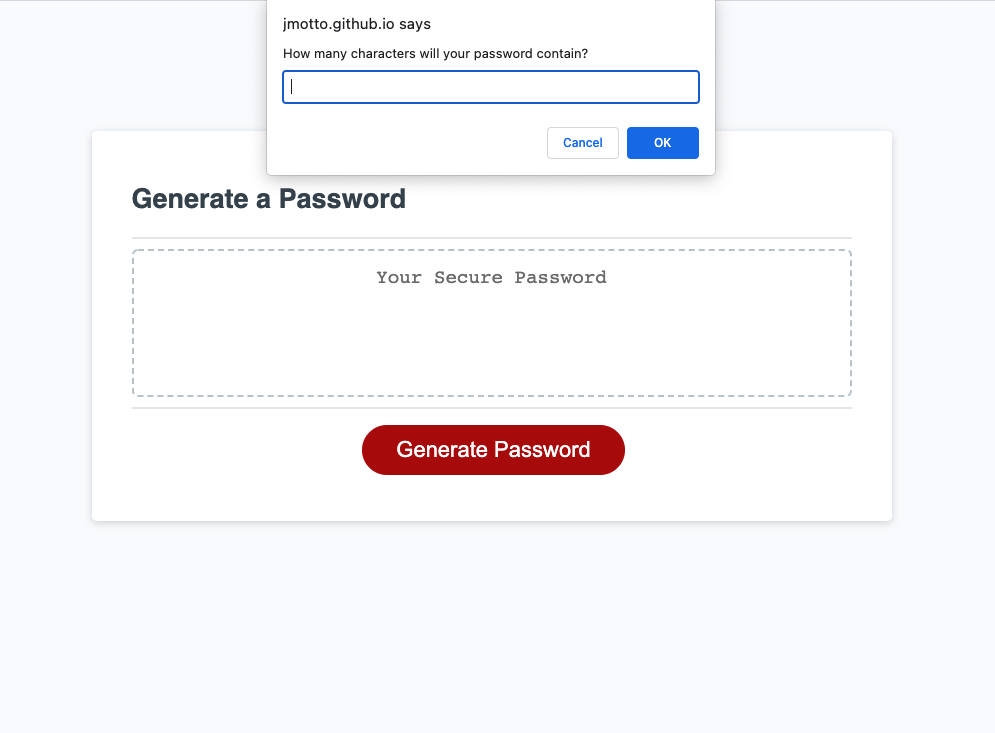
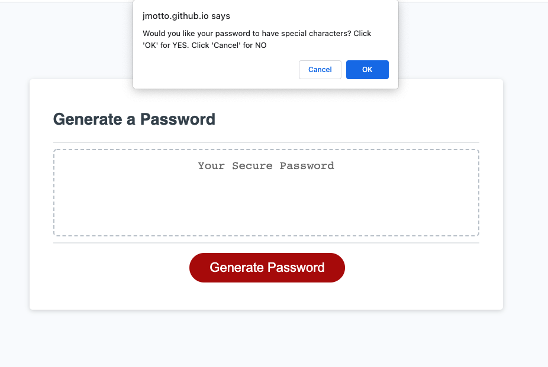
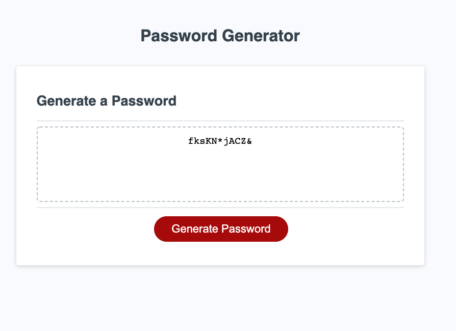

# Password Generator
## Password Generator Challenge Description:
This challenge is to modify code to create the password generator so it generates a random and secure password that meets specified criteria. 

### Functionality of the password generator:

* The user clicks on the "Generate Password" button and is prompted with criteria for the password.

* When user is prompted for length of password, then they can choose between 8 to 128 characters. 

* Then the user can choose if they would like to use special characters, numbers, lowercase letters and/or uppercase letters. They must chose atleast one character type. 

* Once the password criteria have been chosen, then the password is displayed on the page.

### Final Product
Click [here](https://jmotto.github.io/Password-Generator/) to generate your password.

